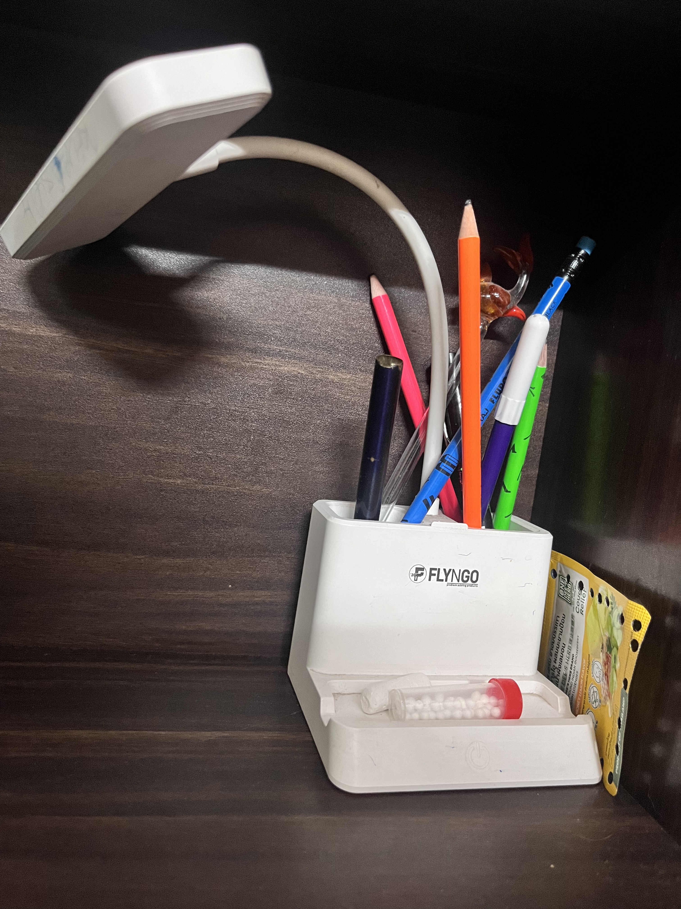
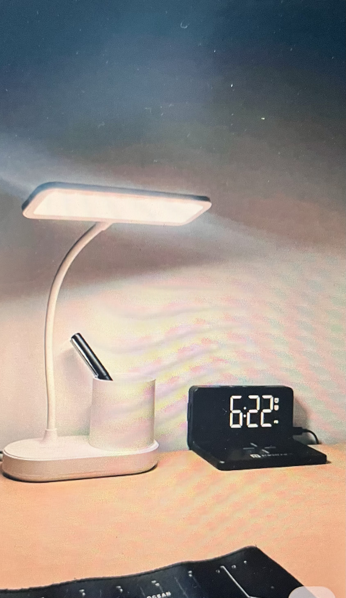
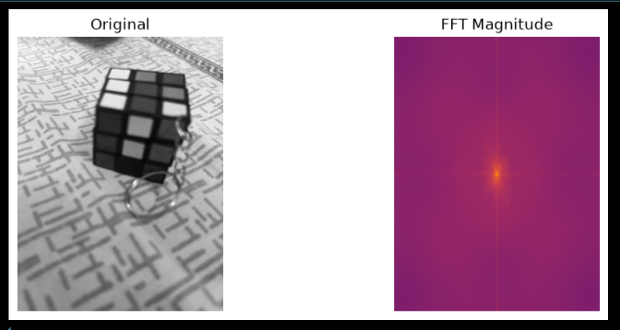
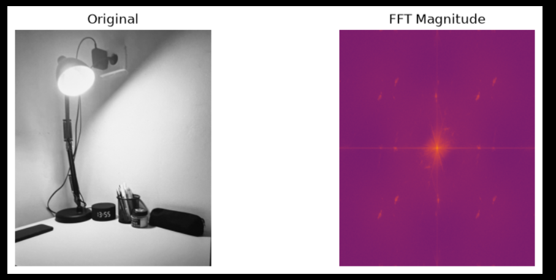
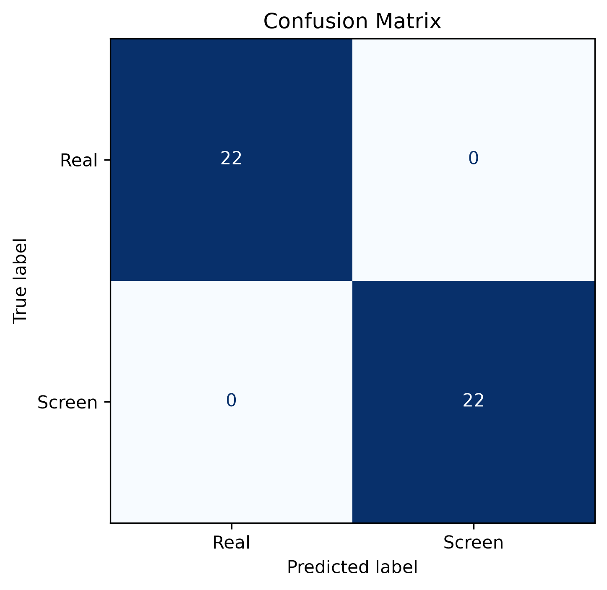
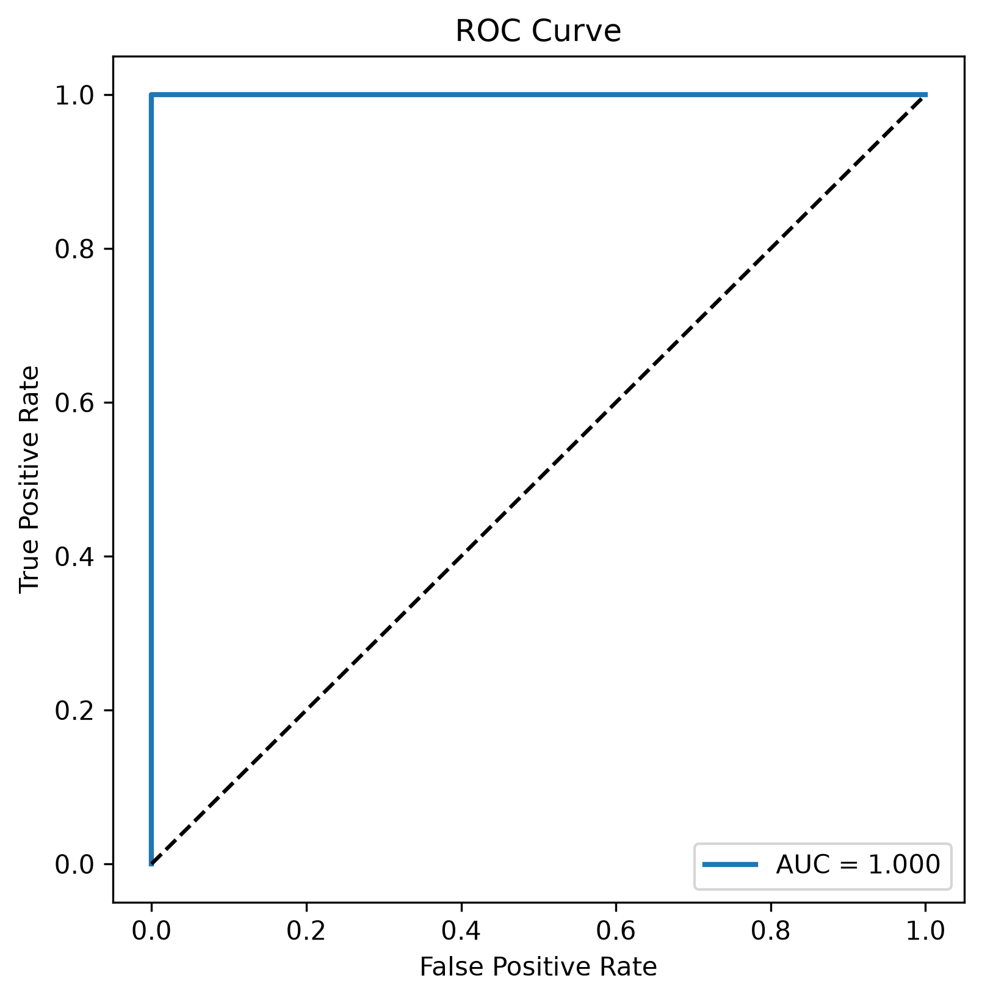

# 📷 Real vs Screen Image Classification

A deep learning-based binary image classification system that identifies whether an image is:

- 📷 **Real Camera Image**
- 🖥️ **Photo of a Digital Screen**

The project uses **Transfer Learning with MobileNetV3-Small** to classify images captured using a smartphone camera. A custom dataset was manually collected for this assignment, followed by exploratory data analysis, model training, evaluation, and inference.

---

# 🚀 Project Overview

Photographs captured directly from a camera and photographs taken of digital screens exhibit different visual characteristics such as:

- Frequency domain patterns
- Display artifacts
- Edge density
- Reflections
- Pixel grid effects

This project explores these differences and trains a lightweight deep learning model capable of distinguishing between the two image categories.

---

# 📂 Dataset

The dataset was manually collected using a smartphone camera.

| Class | Images |
|-------|--------|
| 📷 Real Camera Images | 109 |
| 🖥️ Screen Photos | 108 |
| **Total** | **217** |

The images include multiple indoor and outdoor scenes captured under different lighting conditions and object categories.

---

# 🖼️ Sample Images

| Real Camera Image | Screen Photo |
|:-----------------:|:------------:|
|  |  |

---

# 📊 Exploratory Data Analysis (EDA)

Before training the model, several exploratory analyses were performed to understand the visual differences between the two classes.

The analysis included:

- Image Resolution Analysis
- Fast Fourier Transform (FFT)
- Edge Density Analysis
- Visual Comparison of Image Characteristics

---

# 🔍 Frequency Domain Analysis (FFT)

FFT was used to visualize frequency-domain characteristics of both classes.

### Real Camera Image FFT

<p align="center">

</p>

### Screen Photo FFT

<p align="center">

</p>

The screen images exhibit stronger periodic frequency components compared to real camera images due to display pixel structures.

---

# 🧠 Model Architecture

The classifier uses **MobileNetV3-Small** pretrained on ImageNet.

### Training Configuration

| Parameter | Value |
|-----------|-------|
| Model | MobileNetV3-Small |
| Input Size | 224 × 224 |
| Optimizer | AdamW |
| Loss Function | CrossEntropyLoss |
| Epochs | 20 |
| Batch Size | 8 |

---

# 📁 Project Structure

```text
real-vs-screen-image-classification/
│
├── dataset/
│   ├── real/
│   └── screen/
│
├── models/
│   └── best_model.pth
│
├── notebooks/
│   └── analysis.ipynb
│
├── report/
│
├── results/
│   ├── confusion_matrix.png
│   ├── roc_curve.png
│   ├── real_fft_comparison.png
│   ├── screen_fft_comparison.png
│   ├── sample_real.jpg
│   └── sample_screen.jpg
│
├── src/
│   ├── dataset.py
│   ├── model.py
│   ├── train.py
│   ├── evaluate.py
│   └── predict.py
│
├── README.md
├── requirements.txt
└── .gitignore
```

---

# ⚙️ Installation

Clone the repository

```bash
git clone https://github.com/Anushka261gupta/real-vs-screen-image-classification.git

cd real-vs-screen-image-classification
```

Install dependencies

```bash
pip install -r requirements.txt
```

---

# 🏋️ Training

```bash
python src/train.py
```

---

# 📈 Evaluation

```bash
python src/evaluate.py
```

### Validation Results

```
Accuracy  : 1.00
Precision : 1.00
Recall    : 1.00
F1 Score  : 1.00
```

> These results were obtained on the held-out validation split used during experimentation.

---

# 📉 Confusion Matrix

<p align="center">

</p>

---

# 📊 ROC Curve

<p align="center">

</p>

**ROC-AUC Score:** **1.00**

---

# 🔍 Prediction

Run inference on a single image:

```bash
python src/predict.py --image dataset/real/IMG_5121.jpg
```

Example Output

```
Prediction         : Real Camera Image
Confidence         : 99.13%
Real Probability   : 99.13%
Screen Probability : 0.87%
```

---

# 🛠️ Technologies Used

- Python
- PyTorch
- Torchvision
- OpenCV
- NumPy
- Scikit-learn
- Matplotlib

---

# 📌 Future Improvements

- Increase dataset diversity
- Cross-validation
- Grad-CAM visualization
- Confidence calibration
- Web deployment using Streamlit or FastAPI

---

# 👩‍💻 Author

**Anushka Gupta**

B.Tech Computer Science (AI)

Bennett University
